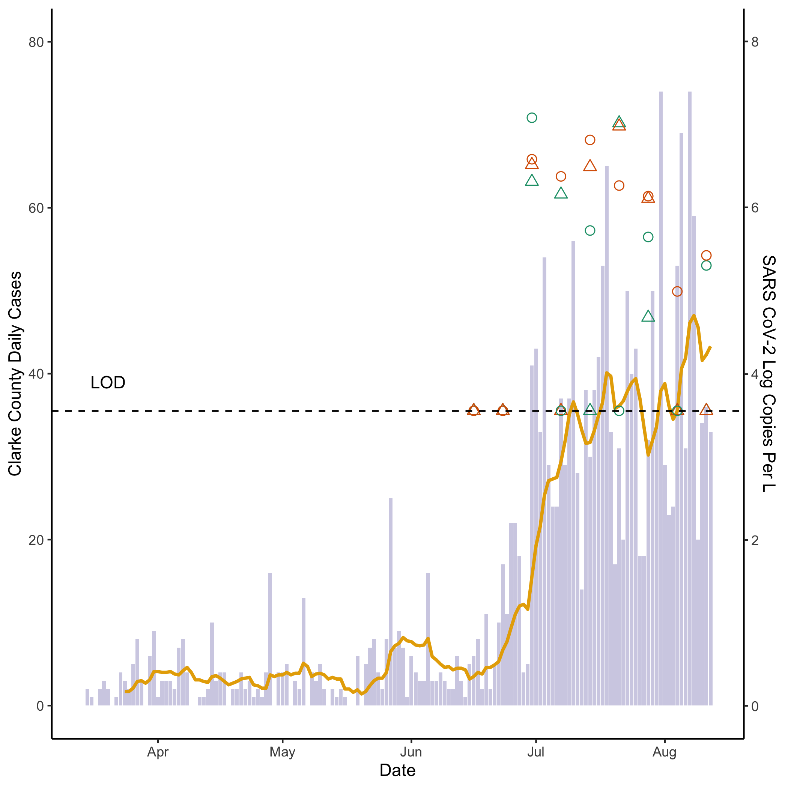

<div style="margin-bottom:50px;">


## COVID-19 Burden of Athens, GA

<div style="margin-bottom:100px;">


```{r covid_master_plot, fig.hold='hold', out.height = "100%", out.width = "100%", echo=FALSE}

```

#### [insert description title]

Sewage samples have been collected weekly from the water reclamation facilities that serve Athens Clarke County (WRF A and WRF B). Samples are tested to detect and measure SARS-CoV-2, the virus that causes COVID-19. We measure by the virus by detecting two genes specific to SARS-CoV-2; the N1 and N2 nucleocapsid genes. These gene targets (N1 and N2) are measured and reported as a concentration (in copies per liter of wastewater). We predict that the changes in the concentration of SARS-CoV-2 in wastewater will reflect the trends of COVID-19 infection in the community. The daily number of new COVID-19 cases in Athens-Clarke County (grey) appear alongside the 10-day moving average of new cases (yellow). The theoretical limit of detection (LOD) is noted. 


